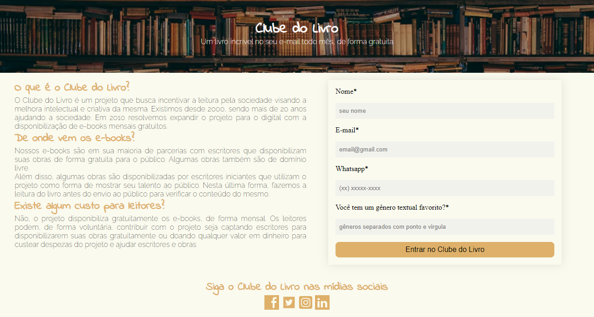

 
&#xa0;
 
<!-- <a href='linkdosite'>Demo</a> -->
 

 
<h1 align='center'>Clube do Livro | Página de Captação de Leads</h1>
 

 

 

 

 

 

<a href='#dart-sobre'>Sobre</a> &#xa0; | &#xa0;
<a href='#sparkles-funcionalidades'>Funcionalidades</a> &#xa0; | &#xa0;
<a href='#rocket-tecnologias'>Tecnologias</a> &#xa0; | &#xa0;
<a href='#memo-licença'>Licença</a> &#xa0; | &#xa0;
<a href='https://github.com/fransilva0' target='_blank'>Autor</a>

 
 
 
## :dart: Sobre ##
 
A Página foi construída para estudos. Inicialmente elaborei o Header contendo o nome do projeto ficticio "Clube do Livro" seguido de uma frase de impacto que pudesse chamar a atenção do usuário logo quando ele entrasse na página. Após isso foi elaborado, no corpo da página, duas seções: uma para informativos sobre o projeto e outro com o formulário de captação de dados do usuário. Logo no final da página se encontra um rodapé com uma chamada para as mídias sociais do projeto, caso o usuário quisesse conhecer mais sobre o mesmo.
 
## :sparkles: Funcionalidades ##
 
:heavy_check_mark: Captação de dados do usuário via formulário; &#xa0;
:heavy_check_mark: Chamada para Inscrição em Mídias Sociais; &#xa0;
 
 
## :memo: Licença ##
 
Este projeto está sob licença MIT. Veja o arquivo [LICENSE](LICENSE.md) para mais detalhes.
 
 
Feito com :heart: por <a href='https://github.com/fransilva0' target='_blank'>Francileudo Oliveira</a>
 
&#xa0;
 
<a href='#top'>Voltar para o topo</a>
